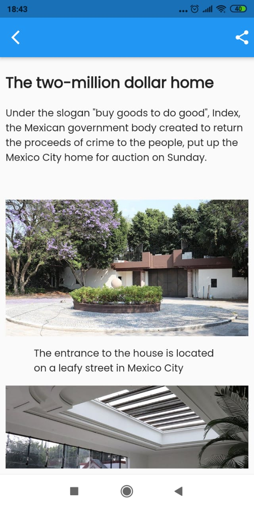

# news_app

Application using dio http cache to cache the API Result and Flutter Widget From HTML to render the html tag

## API

You can edit the API address and Image Address at  lib/mixins/server.dart and get Database and Backend API at https://github.com/mrstein21/news_fastify

## Screen Shoot

 
 